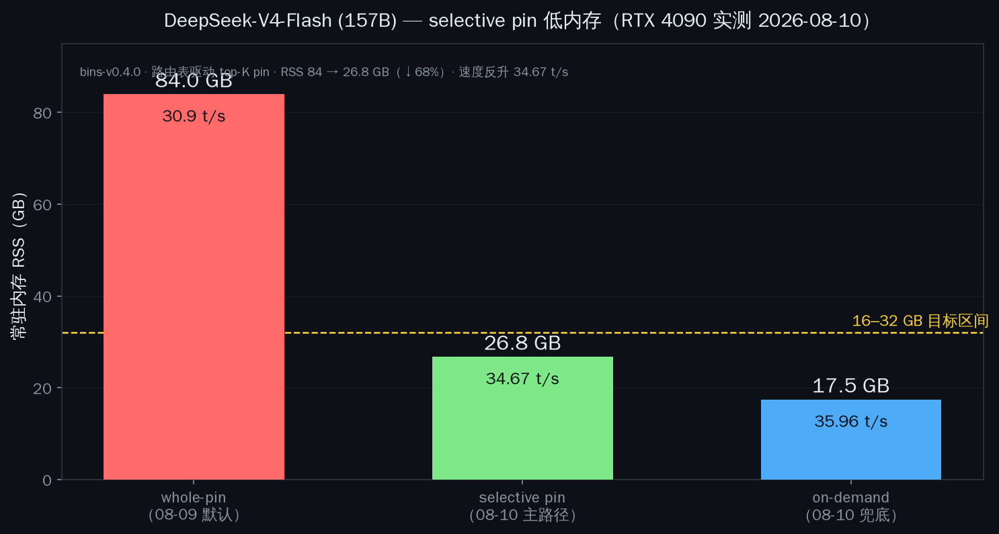

# moe-l2

[English](README.md) | [**中文**](README_zh.md)

[](https://pypi.org/project/moe-l2/)
[](LICENSE)
[](https://github.com/yalun753/moe-l2/actions/workflows/ci.yml)

**MoE 专家卸载（expert offload）低显存方案 — 8GB 显卡也能跑 100B+ MoE 大模型（DeepSeek、Qwen、Mixtral），省 93% 显存，一行 pip 搞定。**

> ⭐ **觉得有用？点个 Star** —— 让更多需要的人发现它。[★ 去 GitHub 点赞](https://github.com/yalun753/moe-l2)

| 你的显卡 | 正常能跑 | **用了 moe-l2** | **实测速度**（RTX 4090） |
|----------|---------|-----------------|----------------------|
| 4 GB | — | DeepSeek-V2-Lite (16B MoE) ✅ | **145.63 t/s** |
| **8 GB** | 7B 稠密模型 | **Qwen3.6-A3B (32B MoE) ✅** | **74.99 t/s** |
| 10-11 GB | — | **DeepSeek-V4-Flash（157B MoE，85 GB 文件）✅** | **35.96 t/s** |

> 速度 = RTX 4090 实测（2026-08-10，selective pin + A3 cache 2048，多架构包）；2080 Ti 全链路（bins-v0.4.0，selective pin）：Qwen 47.24 t/s、DS-V2-Lite 87.25 t/s。详见 [models-benchmark.md](references/models-benchmark.md)。

**DeepSeek-V4-Flash（157B 参数 / 85GB 文件，256 专家、激活 6）也能跑**——RTX 4090 实测 **35.96 t/s**（on-demand 兜底，RSS 17.5GB）；selective pin（v4_top100.map）**34.67 t/s**（RSS 26.8GB）；显存 16.5-16.7GB，2026-08-10 实测。完整报告：[deepseek-v4-flash-verify-20260805.md](references/deepseek-v4-flash-verify-20260805.md) · **全部已测模型汇总：[models-benchmark.md](references/models-benchmark.md)**

**一行安装（Linux x86_64 + NVIDIA 显卡）：**

```bash
curl -fsSL https://raw.githubusercontent.com/yalun753/moe-l2/main/scripts/install.sh | bash
```

安装脚本自动检测显卡/驱动/Python → 从 PyPI 装 moe-l2 → 下载预编译 CUDA 二进制 → 可选下载演示模型（Qwen3.6-35B-A3B，约 11.5GB，断点续传）→ 自检。

**手动安装：**

```bash
pip install moe-l2
moe-l2 download-bins
moe-l2 model download --model qwen3.6-35b   # 可选：下载演示模型（约 11.5GB）
moe-l2 start --model model.gguf --gpu
```

常用命令：

```bash
moe-l2 doctor                        # 环境自检（GPU/CUDA/Python/磁盘）
moe-l2 model list                    # 查看可下载的模型
moe-l2 model download --model <name> # 下载模型（断点续传，走 hf-mirror）
```

连接 `localhost:11435`，现有工具（curl、Open WebUI、LangChain）无需改配置。

### Benchmarked on RTX 4090（2026-08-10，selective pin 主路径）

基于 **RTX 4090** 实测（2026-08-10，selective pin 主路径：路由表驱动 top-K pin + GPU cache 预填充，bins-v0.4.0）：

| 模式 | GPU 显存 | 速度 | 意味着什么 |
|------|----------|------|-----------|
| 标准（全 expert 在 GPU） | 23.3 GB | 65 t/s | 需要 24 GB 显卡 |
| **moe-l2**（selective pin 专家，GPU 计算） | **1.6-4.9 GB** | **DS 145.63 t/s · Qwen 74.99 t/s** | **4 GB 卡也能跑** |
| **节省** | **79% 显存** | 反超全 GPU（224%） | 腾出 ~20 GB 做别的 |

不开 moe-l2，8 GB 显卡**根本无法加载这个模型**——直接 OOM。开了之后 32B MoE 只占 ~3.1 GB（selective pin 专家，GPU 计算），还剩 5 GB 干别的。

> 我们在 RTX 4090 上对 **Qwen3.6-A3B**（32B MoE）和 **DeepSeek-V2-Lite**（16B MoE，64 expert）做了全量测试（2026-08-10，selective pin + A3 cache 2048 槽）：专家驻留 CPU RAM（零显存），路由表预 pin 高频专家，调度器每步只把**激活的专家**拷到 GPU 直算，热专家缓存在 GPU 显存。DS-V2-Lite **145.63 t/s**（4.9GB 显存、2.1GB RSS），Qwen3.6-A3B **74.99 t/s**（3.1GB 显存、2.3GB RSS）。完整报告：[Qwen3.6](references/qwen3.6-a3b-iq2m-benchmark.md) · [DS-V2-Lite](references/deepseek-v2-lite-q2k-benchmark.md) · [models-benchmark](references/models-benchmark.md)


### Selective pin — 低内存主路径（2026-08-10，v0.4.0）



*实测（RTX 4090，2026-08-10，bins-v0.4.0）：whole-pin 84GB / 30.9 t/s → selective pin 26.8GB / 34.67 t/s（路由表 top-K）→ on-demand 兜底 17.5GB / 35.96 t/s。RSS 降 68% 速度反升。另见 [速度 vs 内存散点图](docs/demo/fig5b-selective-pin-speed-rss.png)。*

**selective pin 是当前主路径（v0.4.0）**——路由表（每层 top-K 专家，如 `v4_top100.map` 43 层）预 pin 高频专家为 host-pinned，表外专家走 on-demand 兜底。不设环境变量时保持 whole-pin 默认；`moe-l2 start --gpu` 传 `--router-map <文件>` 或 `--router-top-k N`：

```bash
moe-l2 start --model model.gguf --gpu --router-map v4_top100.map
```


### 多架构二进制（bins-v0.4.0，2026-08-10）

**一个二进制兼容所有 NVIDIA 消费卡**——GTX 1080（sm_61）到 RTX 50 系（sm_120a）。CUDA 12.8 编译，无需按显卡单独编译，`moe-l2 download-bins` 自动拉取。bins-v0.4.0 含 **selective pin（路由表驱动）** + **GPU cache 预填充** + **on-demand pin 主路径** + 专家页淘汰 v3.1（`MOE_L2_LRU_MAX_EXPERTS=N`）+ 分层 pin（`MOE_L2_PIN_LAYERS`）+ A3 cache 2048 槽 + cuda-libs（无 libnccl，单卡不需要）。

| 显卡 | 架构 | DS-V2-Lite 生成 | Qwen3.6-A3B 生成 | 显存 |
|------|------|----------------|-----------------|------|
| RTX 2080 Ti | sm_75（Turing） | 87.25 t/s | 47.24 t/s | ~1.0-2.4 GB |
| RTX 3080 Ti | sm_86（Ampere） | 12.25 t/s | 13.28 t/s | ~1.1-2.2 GB |
| RTX 5090 | sm_120a（Blackwell） | 135.57 t/s | 76.41 t/s | ~1.3-2.5 GB |
| RTX 4090* | sm_89（Ada） | 145.63 t/s | 74.99 t/s | 3.1-4.9 GB |

\* 4090 行为 bins-v0.4.0 全链路实测（2026-08-10：Qwen 74.99 / DS 145.63 t/s，显存 3.1-4.9GB，RSS 2.1-2.3GB；此前 39.0/51.5 为 08-02 单架构基线）；2080 Ti 行为 bins-v0.4.0 全链路实测（moe-l2 start --gpu，selective pin，2026-08-10 重测：Qwen 47.24 / DS 87.25 t/s，比原版 +200~700%）；5090 行为 bins-v0.4.0 全链路实测（2026-08-10：Qwen 76.41 / DS 135.57 t/s，比原版 +687~715%）；3080 Ti 为 v3.1 多架构包（bins-v0.3.0）实测。Qwen 单轮 24.5 t/s（2080 Ti，bins-v0.3.2，旧 host-buffer 11.15 翻倍）。

> 2080 Ti（SM75）、3080 Ti（SM86）、5090（SM120a）已用多架构包实测；3080 Ti 比旧 CUDA 11.8 单架构版**快 55%**（12.25 vs 7.88 t/s）。2026-08-10 bins-v0.4.0 全链路复测：5090 DS **135.57** / Qwen **76.41** t/s（原版 llama.cpp 二进制仅 16.63/9.71——moe-l2 优化释放 Blackwell 真实性能）。完整报告：[multi-arch-three-gpu-benchmark.md](references/multi-arch-three-gpu-benchmark.md)


## 快速开始

### 1. 安装

```bash
pip install moe-l2
```

### 2. 下载 GPU 二进制（仅 `--gpu` 模式需要）

```bash
moe-l2 download-bins
```
从 GitHub Release 拉取预编译的 CUDA llama-server（bins-v0.4.0，约 2.0 GB 多架构全兼容包，含 cuda-libs）。

### 3. 启动

**GPU 模式（推荐，on-demand pin 专家 GPU 直算，省 93% 显存）：**
```bash
moe-l2 start --model /path/to/model.gguf --gpu
```

**纯代理模式**（不省显存，仅 expert 缓存）：
```bash
moe-l2 start --model /path/to/model.gguf --l2-size 4GB
```

代理启动在 `localhost:11435`，直接当普通 OpenAI 兼容接口用就行（GPU 模式下后端 llama-server 监听 11436）。

### 4. 看统计

```bash
moe-l2 stats
# → 命中率: 85% · 槽位: 320/960 · 当前领域: codegen
```

---


## 工作原理（简版）

1. 你的 prompt 到达 moe-l2 代理
2. 领域预测器分类（代码生成 → 数学 → 中文技术 ……）
3. 专家权重 lazy mmap 驻留 CPU RAM（**零显存**），首次激活即 pinned（on-demand pin）——不再整体塞进 GPU
4. GPU 经 PCIe DMA 直读激活专家（cuBLAS），热专家驻留 VRAM（A3 LRU 2048 槽），冷页 v3.1 淘汰
5. 可选 sched-cache（`GGML_CUDA_EXPERT_CACHE=0.25`）：命中热专家走 D2D 免 PCIe，DS 类模型 Prompt +211%

---


### 可视化演示（RTX 4090，2026-08-10）

| Qwen3.6-35B-A3B（32B MoE）— 标准 vs moe-l2 | DeepSeek-V2-Lite（16B MoE）— 8GB 卡 vs 24GB 卡 |
|---|---|
|  |  |

一句话总结：**显存省 79% · 速度反超全 GPU 224% · 模型/显存比 3.9×** —— 8 GB 卡跑出原本 24 GB 卡的效果（RTX 4090 实测 2026-08-10，bins-v0.4.0 selective pin：DS 145.63 t/s @ 4.9 GB / Qwen 74.99 t/s @ 3.1 GB）：


实机录屏：Qwen3.6-35B-A3B 生成 **3200 tokens，全程显存钉在 ~2.4 GB**（41.6 t/s）—— 曲线全程平直，远低于 8 GB 红线：

[`examples/demo-assets/demo-vram-animation.mp4`](examples/demo-assets/demo-vram-animation.mp4)（45 秒，1280×720）· 原始采样：[`examples/demo-assets/rec_data.csv`](examples/demo-assets/rec_data.csv) · 生成全文：[`examples/demo-assets/rec_full.txt`](examples/demo-assets/rec_full.txt)

---


## 适用场景

### ✅ 适合
- **单人聊天** — 用 4-12 GB 显卡跑大 MoE 模型
- **测试和实验** — 在预算硬件上玩 MoE 架构
- **家庭实验室 / 边缘部署** — 每一 GB 显存都珍贵
- **研究 expert 缓存**、分层调度、领域感知预加载

### ❌ 不适合
- 高并发 API 服务（频繁换 expert 产生 I/O 瓶颈）
- 对延迟敏感的应用（SSD 缓存缺失导致速度波动）
- 机械硬盘作存储 — **需要 NVMe 固态**

---


## 系统架构

```
                         ┌─────────────────────────┐
   你的 prompt ──────────▶│  moe-l2 代理 (:11435)    │
                         │                          │
                         │  ┌─────────────────────┐ │
                         │  │ 领域预测器           │ │
                         │  │ (关键词+TF-IDF+语义) │ │
                         │  └────────┬────────────┘ │
                         │           │ 预测领域       │
                         │           ▼               │
                         │  ┌─────────────────────┐ │
                         │  │ L2 缓存 (RAM)       │ │
                         │  │ LRU · mmap · 异步   │ │
                         │  │ 从硬盘预加载         │ │
                         │  └────────┬────────────┘ │
                         │           │ 转发           │
                         └───────────┼───────────────┘
                                     ▼
                         ┌─────────────────────────┐
                         │  llama-server (:11436)   │
                         │  on-demand pin 专家：    │
                         │  lazy mmap 零显存，首次  │
                         │  触碰即 pinned，GPU 经   │
                         │  PCIe DMA 直读；热专家   │
                         │  驻留 VRAM (A3 LRU)，   │
                         │  冷页淘汰 RSS 封顶       │
                         └─────────────────────────┘
```

### 数据驻留层级（2026-08-07 架构）

```
L0 ─ CPU 路由器    门控路由 + 领域分类（你的 CPU）
 ↑
L1 ─ GPU 显存      激活 expert 计算 + KV cache（你的显卡，只放激活权重）
 ↑
L2 ─ CPU RAM       全部专家权重 lazy mmap 驻留，首次触碰即 pinned（零显存）
 ↑
L3 ─ SSD 冷存储    GGUF 文件 mmap，冷专家页按需读入 + v3.1 淘汰（RSS 封顶）
```

专家权重整体 lazy mmap 驻留 CPU RAM（零显存），首次激活即 pinned，GPU 经 PCIe DMA 直读；热专家驻留 VRAM（A3 LRU 2048 槽），冷页 v3.1 淘汰保持 RSS 封顶——这就是为什么 32B MoE 只占 ~2.9 GB 显存、85GB V4 也能在 11GB 卡上跑。

---


## CLI 参考

| 命令 | 说明 |
|------|------|
| `moe-l2 start --model <路径> --l2-size <大小>` | 启动代理 + 缓存 |
| `moe-l2 start --model <路径> --gpu` | 使用 GPU 加速的 llama-server 启动 |
| `moe-l2 stats --port <端口>` | 查看实时缓存统计 |
| `moe-l2 download-bins [--release TAG]` | 从 GitHub 下载预编译 GPU 二进制 |
| `moe-l2 collect --model <路径>` | 采集 MoE 路由数据 → `~/.moe-l2/maps/domain_expert_map.json` |
| `moe-l2 stop --port <端口>` | 停止代理 |

可选参数：
- `--model auto`：自动扫描 `/opt/data/models/*.gguf`
- `--l2-size 4GB` / `--l2-size 512MB`：目标缓存大小
- `--port 11435`（默认）
- `--gpu`：启用 GPU 模式（需要 CUDA + NVIDIA 显卡）

> **GPU 二进制**：不在 git 中追踪（`llama_bins.tar.gz`，bins-v0.4.0 约 2.0 GB 多架构包，sm_61/75/86/89/120a 一个二进制兼容所有 NVIDIA 消费卡，含 cuda-libs），运行时通过 `moe-l2 download-bins` 获取。

---


## 平台要求

- **仅 Linux x86_64** — 预编译二进制目标为 Linux AMD64（CUDA `.so` + `llama-server`）
- macOS、Windows、ARM Linux **暂不支持**
- **强烈建议使用 NVMe 固态硬盘**
- `--gpu` 模式需要 NVIDIA 显卡（CUDA 后端）

---


## 更多数据

| 指标 | 标准 | moe-l2 |
|------|------|--------|
| Prompt 处理（DS-V2-Lite） | 110 t/s | 99 t/s · **308 t/s**（sched-cache=0.25） |
| 生成速度（DS-V2-Lite） | 65 t/s | 145.63 t/s · 39.2 t/s（sched-cache=0.25，08-02） |
| 生成速度（Qwen3.6-A3B） | — | 74.99 t/s |
| 显存占用 | 23.3 GB | **2.0 GB** |
| 模型大小 / 显存比 | 0.26× | **3.1×** |

速度取舍是可预期的：专家驻留 CPU RAM（mmap 惰性 + on-demand pin，零显存），调度器每步只把激活的专家拷到 GPU。2026-08-10 bins-v0.4.0 selective pin 主路径：DS-V2-Lite 生成 **145.63 t/s**（+284%）、Qwen3.6-A3B **74.99 t/s**（+49%，超 pre-lazy 46.5）；DS 开 sched-cache=0.25 后 prompt 处理 308 t/s（+211%，08-02 口径）。

---


## 相关工作

### AirLLM（lyogavin/airllm，~29k stars）

AirLLM 是通用型超大模型分层加载方案，以 **Transformer 整层**为调度粒度：推理全程仅在显存保留单一层权重，其余落盘交换，实现极致低显存门槛（4GB 跑 70B）。但存在三个短板：① 每生成一个 Token 都要反复读写磁盘加载/释放整层权重，IO 开销巨大，对话生成速度极低；② 无 MoE 专属路由预测与专家热缓存（2026-07 才开始逐专家流式加载，Kimi K3），重复提问持续触发大量磁盘读取；③ 基于 Hugging Face Transformers 原生开发，无内置 OpenAI 服务接口，难以直接对接 Open WebUI、LangChain 等工具链。

| 维度 | AirLLM | moe-l2 |
|------|--------|--------|
| 调度最小单元 | Transformer 完整网络层 | **MoE 独立专家（稀疏最优）** |
| 目标模型 | 全模型兼容（稠密 + MoE） | **深度优化 MoE（DeepSeek/Qwen/Mixtral）** |
| 底层权重格式 | Hugging Face 原生权重 | **GGUF（llama.cpp 生态）** |
| 运行平台 | Windows/macOS/Linux 全兼容 | Linux x86_64 + NVIDIA 显卡 |
| MoE 场景内存 | 整层落盘交换，无热缓存 | **85GB V4：VRAM 8.3GB + RSS 11-12GB 封顶（实测）** |
| MoE 场景速度 | 逐层反复磁盘交换，适合批量离线 | 热专家缓存减少磁盘 IO，支持实时对话（Qwen 全链路 9.3 t/s 实测） |
| 服务接口 | 仅 Python 代码调用，无内置 Web 服务 | **内置 OpenAI 兼容代理（11435），开箱即用** |
| 显卡适配 | 原生 transformers，CUDA 适配繁琐 | **download-bins 多架构内核，10 系~50 系 N 卡全覆盖** |
| 超大分片模型 | 无针对性适配 | **原生修复多分片元数据解析 BUG，85GB 3 分片 V4 稳定** |

**选择建议**：选 moe-l2——本地跑 DeepSeek/Qwen 等 MoE 日常聊天、8G~12G 老消费 N 卡兼顾显存与速度、需要 OpenAI API 对接工具链、使用多分片超大 GGUF。选 AirLLM——需要运行稠密大模型、使用 Windows/macOS/AMD 或 CPU-only 环境（moe-l2 当前仅支持 Linux + NVIDIA）、仅一次性批量生成、只能用原生 HF 权重。

---


## 测试

每次 push 自动跑 CI（GitHub Actions，Python 3.10–3.13）：ruff 静态检查 + pytest 覆盖率（低于 50% 判失败）+ 打包验证。状态徽章：[](https://github.com/yalun753/moe-l2/actions/workflows/ci.yml)

- **113 个测试**覆盖 Python 调度核心：领域预测器（关键词边界、兜底）、L2 缓存（LRU 淘汰、pin、领域切换）、GGUF 权重读取（合成模型）、透明代理（真实假后端 HTTP，阻塞 + SSE 流式）、CLI 辅助函数与数据飞轮。
- **覆盖率**：核心模块 72–88%（cache 88%、proxy 78%、gguf_reader 73%、predictor 72%），总计约 55%。
- 本地运行：
  ```bash
  uv sync --group dev
  uv run pytest tests/
  uv run ruff check moe_l2/ tests/
  ```

> C++ 侧（llama.cpp on-demand-pin / expert-cache 补丁）依赖 GPU，由 `references/` 下的端到端实测报告验证——见 [models-benchmark.md](references/models-benchmark.md)。


## 项目状态

- ✅ 领域预测器（关键词 + 可选语义）
- ✅ L2 缓存（mmap LRU、线程安全、异步预加载）
- ✅ 透明代理（HTTP/SSE 转发）
- ✅ CLI（start/stats/collect/embed-map/download-bins，自动模型检测，GPU 模式）
- ✅ **selective pin + GPU 预填充（2026-08-10，v0.4.0，当前主路径）**：路由表驱动 top-K pin → V4 RSS **84.4 → 26.8GB** 且 **34.67 t/s**（on-demand 兜底 17.5GB / 35.96 t/s）；DS **145.63** / Qwen **74.99** t/s（4090）；GPU cache 预填充让冷启动 round1 10.7 → 19.7 t/s（+84%）。历史里程碑：host-buffer 直算（08-02）→ on-demand pin（08-07）→ selective pin（08-10）
- ✅ cache 挂 sched 拷贝层（2026-08-02）：DS 类模型 Prompt 99 → 308 t/s（+211%，cache=0.25，VRAM 不变）；Qwen/Mixtral 无收益不开
- ✅ **DeepSeek-V4-Flash（157B MoE）验证通过（2026-08-05）**：85GB 三片 GGUF 在 2080 Ti（11GB）上跑通——VRAM 8.3-9.1GB、RSS 靠专家页淘汰 v3.1 封顶（`MOE_L2_LRU_MAX_EXPERTS` 固定专家数 LRU）、多分片 GGUF 解析修复已随 0.7.0 发布。[完整报告](references/deepseek-v4-flash-verify-20260805.md)
- ✅ PyPI 包（`moe-l2`）

---


## 许可证

**Apache 2.0。** 详见 [LICENSE](LICENSE)。
