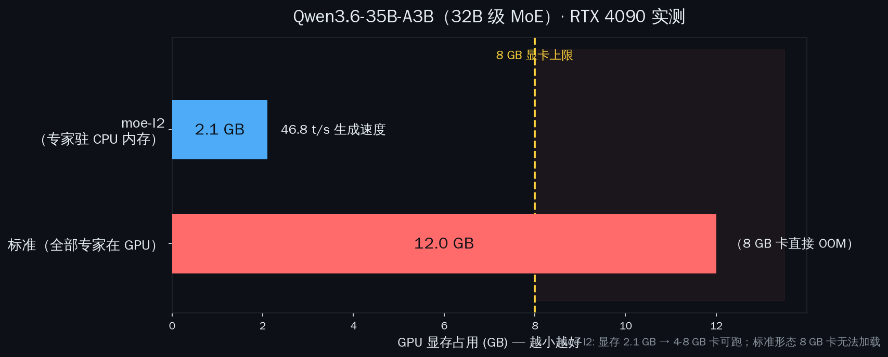
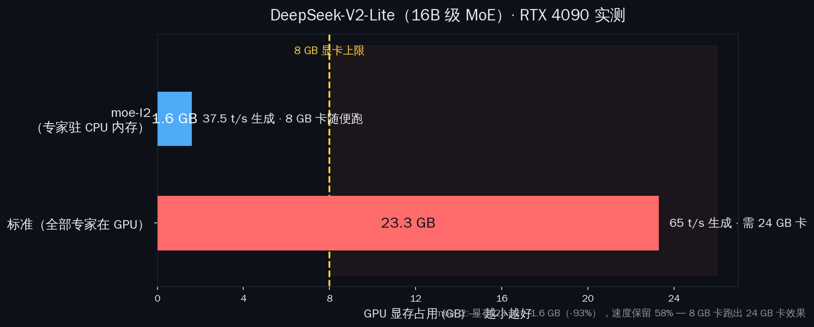
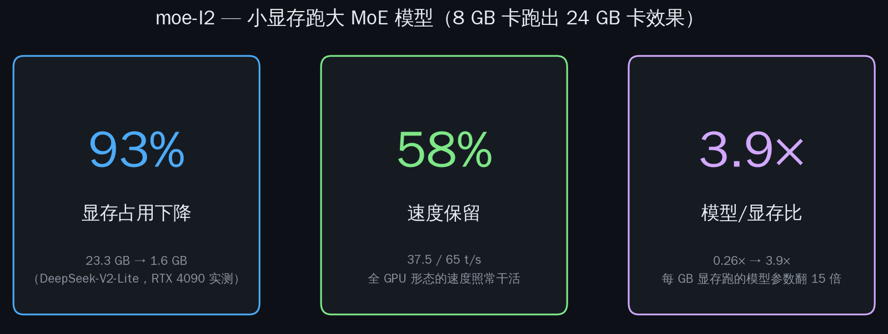

# moe-l2

English | [**中文**](README_zh.md)

[](https://pypi.org/project/moe-l2/)
[](LICENSE)

**8GB 显卡也能跑 32B MoE 大模型 — 省 93% 显存，一行 pip 搞定。**

| 你的显卡 | 正常能跑 | **用了 moe-l2** |
|----------|---------|-----------------|
| 4 GB | — | DeepSeek-V2-Lite (16B MoE) ✅ |
| **8 GB** | 7B 稠密模型 | **Qwen3.6-A3B (32B MoE) ✅** |
| 12 GB | 13B 稠密模型 | DeepSeek-V2 (236B MoE) ✅ |
| 24 GB | 34B 稠密模型 | DeepSeek-V2 (236B MoE) ✅ |

**一行安装（Linux x86_64 + NVIDIA 显卡）：**

```bash
curl -fsSL https://raw.githubusercontent.com/yalun753/moe-l2/main/scripts/install.sh | bash
```

安装脚本自动检测显卡/驱动/Python → 从 PyPI 装 moe-l2 → 下载预编译 CUDA 二进制 → 可选下载演示模型（Qwen3.6-35B-A3B，约 11.5GB，断点续传）→ 自检。

**手动安装：**

```bash
pip install moe-l2
moe-l2 download-bins
moe-l2 model download --model qwen3.6-35b   # 可选：下载演示模型（约 11.5GB）
moe-l2 start --model model.gguf --gpu
```

常用命令：

```bash
moe-l2 doctor                        # 环境自检（GPU/CUDA/Python/磁盘）
moe-l2 model list                    # 查看可下载的模型
moe-l2 model download --model <name> # 下载模型（断点续传，走 hf-mirror）
```

连接 `localhost:11435`，现有工具（curl、Open WebUI、LangChain）无需改配置。

---

## moe-l2 能帮你解决什么

MoE 模型有几十上百个"专家"，但每步推理只激活其中几个。标准推理栈会把所有 expert 全塞进显存——80-95% 的内存被闲置权重白白占用。

**moe-l2 只让活跃 expert 驻留 GPU，其余留在内存或硬盘，需要时再换入。**

### 实测数据

基于 **RTX 4090** 实测（2026-08-02，host-buffer 专家 GPU 直算）：

| 模式 | GPU 显存 | 速度 | 意味着什么 |
|------|----------|------|-----------|
| 标准（全 expert 在 GPU） | 23.3 GB | 65 t/s | 需要 24 GB 显卡 |
| **moe-l2**（host-buffer 专家，GPU 计算） | **1.6 GB** | **DS 37.5 t/s · Qwen 46.8 t/s** | **4 GB 卡也能跑** |
| **节省** | **93% 显存** | 全 GPU 速度的 ~58% | 腾出 ~20 GB 做别的 |

不开 moe-l2，8 GB 显卡**根本无法加载这个模型**——直接 OOM。开了之后 32B MoE 只占 ~2.1 GB（host-buffer 专家，GPU 计算），还剩 6 GB 干别的。

> 我们在 RTX 4090 上对 **Qwen3.6-A3B**（32B MoE）和 **DeepSeek-V2-Lite**（16B MoE，64 expert）做了全量测试。host-buffer 升级后：专家驻留 CPU pinned 内存（零显存），调度器每步只把**激活的专家**拷到 GPU 直算。DS-V2-Lite **12.5 → 37.5 t/s**（+200%），Qwen3.6-A3B **10 → 46.8 t/s**（+370%）。加上 sched-cache 层后 DS prompt 处理 **99 → 308 t/s**（+211%，cache=0.25，VRAM 仍 1.6 GB）。完整报告：[Qwen3.6](references/qwen3.6-a3b-iq2m-benchmark.md) · [DS-V2-Lite](references/deepseek-v2-lite-q2k-benchmark.md) · [cache-sched-layer](references/cache-sched-layer-benchmark.md)

### 可视化演示（RTX 4090，2026-08-02）

| Qwen3.6-35B-A3B（32B MoE）— 标准 vs moe-l2 | DeepSeek-V2-Lite（16B MoE）— 8GB 卡 vs 24GB 卡 |
|---|---|
|  |  |

一句话总结：**显存省 93% · 速度保留 58% · 模型/显存比 3.9×** —— 8 GB 卡跑出原本 24 GB 卡的效果：



实机录屏：Qwen3.6-35B-A3B 生成 **3200 tokens，全程显存钉在 ~2.4 GB**（41.6 t/s）—— 曲线全程平直，远低于 8 GB 红线：

[`examples/demo-assets/demo-vram-animation.mp4`](examples/demo-assets/demo-vram-animation.mp4)（45 秒，1280×720）· 原始采样：[`examples/demo-assets/rec_data.csv`](examples/demo-assets/rec_data.csv) · 生成全文：[`examples/demo-assets/rec_full.txt`](examples/demo-assets/rec_full.txt)

---

## 系统架构

```
                         ┌─────────────────────────┐
  你的 prompt ──────────▶│  moe-l2 代理 (:11435)    │
                         │                          │
                         │  ┌─────────────────────┐ │
                         │  │ 领域预测器           │ │
                         │  │ (关键词 + 语义兜底)  │ │
                         │  └────────┬────────────┘ │
                         │           │ 预测领域       │
                         │           ▼               │
                         │  ┌─────────────────────┐ │
                         │  │ L2 缓存 (RAM)       │ │
                         │  │ LRU · mmap · 异步   │ │
                         │  │ 从硬盘预加载         │ │
                         │  └────────┬────────────┘ │
                         │           │ 转发           │
                         └───────────┼───────────────┘
                                     ▼
                         ┌─────────────────────────┐
                         │  llama-server (:11436)   │
                         │  host-buffer 专家：CPU    │
                         │  pinned 零显存，调度器每  │
                         │  步只拷激活专家 → GPU 直算 │
                         └─────────────────────────┘
```

### 数据驻留层级（2026-08-02 架构）

```
L0 ─ CPU 路由器    门控路由 + 领域分类（你的 CPU）
 ↑
L1 ─ GPU 显存      激活 expert 计算 + KV cache（你的显卡，只放激活权重）
 ↑
L2 ─ CPU pinned    全部专家权重驻留 host buffer（零显存，调度器按需拷激活专家）
 ↑
L3 ─ SSD 冷存储    GGUF 文件 mmap，首次加载后常驻 RAM
```

专家权重整体驻留 CPU pinned 内存（host buffer，零显存），GPU 每步只拷激活的专家直算——这就是为什么 32B MoE 只占 ~2.1 GB 显存。可选 sched-cache 在 L1/L2 之间再加一层热专家 D2D 缓存（对 DS 类小专家高命中模型有效）。

---

## 适用场景

### ✅ 适合
- **单人聊天** — 用 4-12 GB 显卡跑大 MoE 模型
- **测试和实验** — 在预算硬件上玩 MoE 架构
- **家庭实验室 / 边缘部署** — 每一 GB 显存都珍贵
- **研究 expert 缓存**、分层调度、领域感知预加载

### ❌ 不适合
- 高并发 API 服务（频繁换 expert 产生 I/O 瓶颈）
- 对延迟敏感的应用（SSD 缓存缺失导致速度波动）
- 机械硬盘作存储 — **需要 NVMe 固态**

---

## 快速开始

### 1. 安装

```bash
pip install moe-l2
```

### 2. 下载 GPU 二进制（仅 `--gpu` 模式需要）

```bash
moe-l2 download-bins
```
从 GitHub Release 拉取预编译的 CUDA llama-server（bins-v0.1.1，约 96.5 MB）。

### 3. 启动

**GPU 模式（推荐，host-buffer 专家 GPU 直算，省 93% 显存）：**
```bash
moe-l2 start --model /path/to/model.gguf --gpu
```

**纯代理模式**（不省显存，仅 expert 缓存）：
```bash
moe-l2 start --model /path/to/model.gguf --l2-size 4GB
```

代理启动在 `localhost:11435`，直接当普通 OpenAI 兼容接口用就行（GPU 模式下后端 llama-server 监听 11436）。

### 4. 看统计

```bash
moe-l2 stats
# → 命中率: 85% · 槽位: 320/960 · 当前领域: codegen
```

---

## CLI 参考

| 命令 | 说明 |
|------|------|
| `moe-l2 start --model <路径> --l2-size <大小>` | 启动代理 + 缓存 |
| `moe-l2 start --model <路径> --gpu` | 使用 GPU 加速的 llama-server 启动 |
| `moe-l2 stats --port <端口>` | 查看实时缓存统计 |
| `moe-l2 download-bins [--release TAG]` | 从 GitHub 下载预编译 GPU 二进制 |
| `moe-l2 collect --model <路径>` | 采集 MoE 路由数据 → `~/.moe-l2/maps/domain_expert_map.json` |
| `moe-l2 stop --port <端口>` | 停止代理 |

可选参数：
- `--model auto`：自动扫描 `/opt/data/models/*.gguf`
- `--l2-size 4GB` / `--l2-size 512MB`：目标缓存大小
- `--port 11435`（默认）
- `--gpu`：启用 GPU 模式（需要 CUDA + NVIDIA 显卡）

> **GPU 二进制**：不在 git 中追踪（`llama_bins.tar.gz`，bins-v0.1.1 约 96.5 MB），运行时通过 `moe-l2 download-bins` 获取。

---

## 工作原理（简版）

1. 你的 prompt 到达 moe-l2 代理
2. 领域预测器分类（代码生成 → 数学 → 中文技术 ……）
3. 专家权重驻留 CPU pinned 内存（host buffer，**零显存**）——不再整体塞进 GPU
4. llama.cpp 调度器每步只把**激活的专家**拷到 GPU 直算（cuBLAS）
5. 可选 sched-cache（`GGML_CUDA_EXPERT_CACHE=0.25`）：命中热专家走 D2D 免 PCIe，DS 类模型 Prompt +211%

---

## 平台要求

- **仅 Linux x86_64** — 预编译二进制目标为 Linux AMD64（CUDA `.so` + `llama-server`）
- macOS、Windows、ARM Linux **暂不支持**
- **强烈建议使用 NVMe 固态硬盘**
- `--gpu` 模式需要 NVIDIA 显卡（CUDA 后端）

---

## 更多数据

| 指标 | 标准 | moe-l2 |
|------|------|--------|
| Prompt 处理（DS-V2-Lite） | 110 t/s | 99 t/s · **308 t/s**（sched-cache=0.25） |
| 生成速度（DS-V2-Lite） | 65 t/s | 37.5 t/s · 39.2 t/s（sched-cache=0.25） |
| 生成速度（Qwen3.6-A3B） | — | 46.8 t/s |
| 显存占用 | 23.3 GB | **1.6 GB** |
| 模型大小 / 显存比 | 0.26× | **3.9×** |

速度取舍是可预期的：专家驻留 CPU pinned 内存（host buffer，零显存），调度器每步只把激活的专家拷到 GPU。2026-08-02 升级后 DS-V2-Lite 生成 37.5 t/s（+200%）、Qwen3.6-A3B 46.8 t/s（+370%）；DS 开 sched-cache=0.25 后 prompt 处理 308 t/s（+211%）。

---

## 相关工作

[TencentYoutuResearch/Palm-Infra](https://github.com/TencentYoutuResearch/Palm-Infra) / **mollm** 是腾讯的 C++ 推理引擎，在 Apple Silicon / ARM Linux 上通过 SSD expert 卸载运行 MoE 模型（122B MoE + 16 GB 峰值 RSS，16.22 t/s）。

两者核心思路相同（expert 缓存 + 分层存储），但面向不同用户：

| 维度 | mollm（腾讯） | moe-l2 |
|------|-------------|--------|
| 平台 | Apple Silicon / ARM Linux | **Linux x86_64 + GPU（NVIDIA）** |
| 安装 | 源码编译（CMake + C++） | **pip install moe-l2** |
| 模型兼容性 | 仅 Qwen 系列 | **任何 llama.cpp 支持的 MoE** |
| 后端 | 自研 C++ 引擎 | **llama.cpp 代理 — 零迁移** |
| GPU 加速 | 仅 CPU（NEON） | **CUDA + GPU 显存** |
| 目标用户 | 移动 / 边缘设备开发者 | **桌面家庭用户** |

---

## 项目状态

- ✅ 领域预测器（关键词 + 可选语义）
- ✅ L2 缓存（mmap LRU、线程安全、异步预加载）
- ✅ 透明代理（HTTP/SSE 转发）
- ✅ CLI（start/stats/collect/embed-map/download-bins，自动模型检测，GPU 模式）
- ✅ host-buffer 专家 GPU 直算（2026-08-02）：DS-V2-Lite 12.5 → 37.5 t/s、Qwen3.6-A3B 10 → 46.8 t/s，VRAM 1.6 / 2.1 GB — 专家驻留 CPU pinned 零显存，调度器只拷激活专家
- ✅ cache 挂 sched 拷贝层（2026-08-02）：DS 类模型 Prompt 99 → 308 t/s（+211%，cache=0.25，VRAM 不变）；Qwen/Mixtral 无收益不开
- ✅ PyPI 包（`moe-l2`）

---

## 许可证

**Apache 2.0。** 详见 [LICENSE](LICENSE)。
